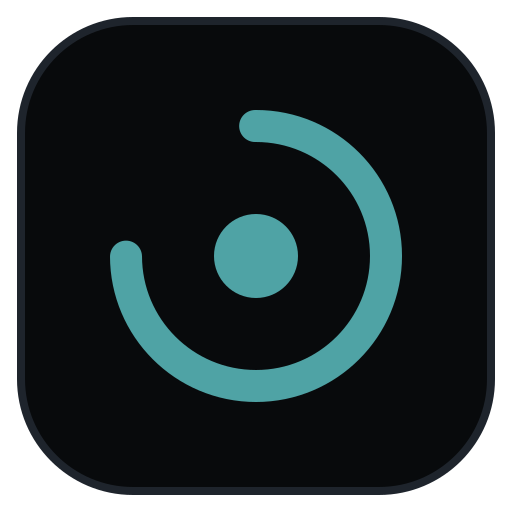

# LifeLog — The Sovereign Personal OS

### The Offline-First, Zero-Cloud Personal Operating System for Tasks, Notes, Habits & Deep Work.

**Crafted with precision by Krish Patel**

[🚀 Live Web App](https://krrish1411.github.io/Lifelog-Releases/) • [📦 Official Downloads](https://github.com/Krrish1411/Lifelog-Releases/releases) • [📖 Full Feature Spec](features.md) • [📋 Release Playbook](RELEASE_PLAYBOOK.md)

---

## 🛡️ Zero-Cloud Guarantee

LifeLog was engineered from the ground up to solve subscription fatigue and privacy invasion:

* **0 Third-Party Telemetry**: Zero analytics, zero tracking cookies, zero Facebook/Google pixels. The app makes **zero outbound network requests** on launch.
* **100% Native SQLite WAL**: High-performance local storage powered by native `node:sqlite` (`DatabaseSync`) on Desktop and WebAssembly `sql.js` on Web & Android.
* **Hardware Device-Bound Cryptography**: Local AES-256-GCM row-level encryption bound to your device hardware keys.
* **Pure Peer-to-Peer DTLS Sync**: Sync devices directly over encrypted WebRTC data channels. No middleman servers ever see, parse, or store your notes.
* **Universal Transparent Backups**: 1-click portable `.lifelog` backups with zero cloud lock-in.

---

## ⚡ The 7 Core Pillars

1. **Unified Task Agenda**: Multi-block timebox scheduling, hierarchical subtasks, recurrence engine, and drag-to-tray unblocking.
2. **Deep Focus Studio**: Pomodoro and Stopwatch timers with integrated ambient sound mixer (Rain, Cafe, White Noise, Binaural Beats) and a persistent timer popout window.
3. **Encrypted Second Brain (Notes)**: Dual-pane markdown editor with dynamic `@tasks`, `#projects`, and `[[notes]]` mention autocomplete, plus encrypted binary file attachments.
4. **Time-Grid Calendar**: Visual 24-hour day, week, and month scheduling with drag-and-drop habit time-slot locking.
5. **Habit Cadence & Streaks**: Daily and weekly frequencies, automatic calendar projection, and mathematical streak tracking.
6. **Honest Daily Log & Sleep**: Morning intentions, evening retrospectives, circadian 24-hour time budgeting, and energy ratings.
7. **Calibrated Productivity Analytics**: Focus calibration curves, energy-to-mood correlation, and zero-lag executive PDF summary export.

---

## 📦 Downloads & Releases

Pre-compiled, hardened, zero-telemetry binaries are hosted on the [**Official Lifelog-Releases Hub**](https://github.com/Krrish1411/Lifelog-Releases/releases):

| Platform | Format | Package |
|---|---|---|
| 🪟 **Windows** | Setup & Portable | `LifeLog Setup 1.0.0.exe` • `LifeLog 1.0.0.exe` |
| 🍎 **macOS** | Universal DMG | `LifeLog-1.0.0.dmg` (Intel & Apple Silicon) |
| 🐧 **Linux** | AppImage & Deb | `LifeLog-1.0.0.AppImage` • `lifelog_1.0.0_amd64.deb` |
| 📱 **Android** | Native APK | `LifeLog-v1.0.0.apk` |
| 🌐 **Web App** | Instant Browser | [Launch on GitHub Pages](https://krrish1411.github.io/Lifelog-Releases/) |

---

## 💡 Support, Feedback & Community

LifeLog is 100% free and sovereign. We love hearing from users:

* 📧 **Direct Email Feedback**: [`getlifelog@proton.me`](mailto:getlifelog@proton.me) (zero-knowledge, 100% private)
* 🐙 **Public Issue Tracker**: [Submit a Bug or Feature Idea](https://github.com/Krrish1411/Lifelog-Releases/issues)
* ☕ **Support the Project**: [Buy Me a Coffee](https://buymeacoffee.com/Krrish1411)

---

## 📄 Documentation Reference

* **[`features.md`](features.md)**: Exhaustive 220+ line technical specification of every view, shortcut, algorithm, and schema.
* **[`RELEASE_PLAYBOOK.md`](RELEASE_PLAYBOOK.md)**: Step-by-step production binary compilation, checksumming, and publishing runbook.
* **[`progress.md`](progress.md)**: Authoritative architectural changelog and 35-file manifest.

---

<b>LifeLog</b> — Your days, sovereign and clear.

